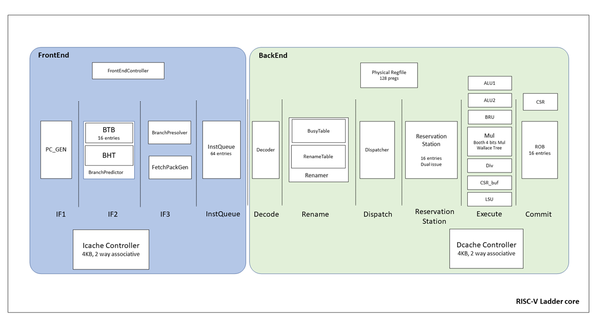

# RISC-V Ladder

好风凭借力,送我上青云


RISC-V Ladder is an dual-issued, 10 staged, out-of-order riscv64 core in chisel programming lanuage.



Sbt is used to build the chisel files. Verilator is used to run simulations.

the basic file structure is as following:

```
-csrc //verilator csrs
-genrtl //chisel generated verilog files
-project //sbt configs
-src //chisel source code
-verilogtestbench //some testbenches
-vsrc //vsrcs for dpi-c function
```

RISC-V Ladder is finished under  [YSYX project]([一生一芯计划 (oscc.cc)](https://ysyx.oscc.cc/)).